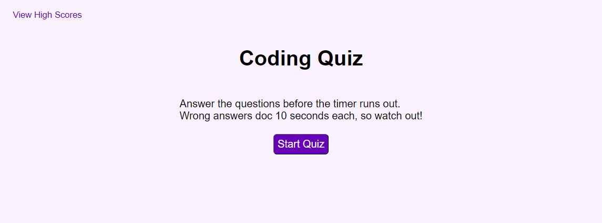

# Coding Quiz
## Description & Usage
A website for quizzing your coding knowledge that keeps track of your scores.
## Website Preview
- Website Link: 
- Repository Link: https://github.com/clendinning1/coding-quiz

## Sources
- [MDN](https://developer.mozilla.org/en-US/)
- [W3](https://www.w3schools.com/)
- https://masteringjs.io/tutorials/fundamentals/wait-1-second-then
- https://stackoverflow.com/questions/5410820/how-can-i-show-all-the-localstorage-saved-variables